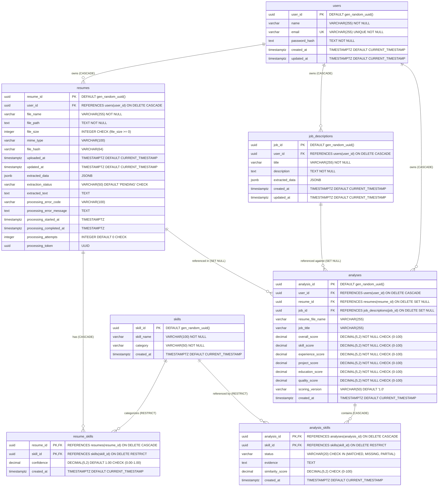

# Database Entity-Relationship Diagram & Schema Specification

This document provides the definitive relational schema and Entity-Relationship (ER) diagram for the **AI-Powered Resume Analyzer and Job Matching Platform**.

The specifications below reflect the exact database structure established across Migrations `001` through `005` in `database/migrations/` and consolidated in `database/schema.sql`.

---

## 1. Entity-Relationship Diagram



---

## 2. Table Specifications & Integrity Constraints

### 2.1 `users`
* `user_id` (UUID, Primary Key): Generated via `gen_random_uuid()`.
* `name` (VARCHAR(255), NOT NULL): User's full display name.
* `email` (VARCHAR(255), UNIQUE, NOT NULL): User email address. Enforced case-insensitive unique via expression index `idx_users_lower_email`.
* `password_hash` (TEXT, NOT NULL): Salted bcrypt hash with 10 salt rounds. Plaintext passwords are never stored.
* `created_at` (TIMESTAMPTZ, NOT NULL, DEFAULT `CURRENT_TIMESTAMP`): Account creation timestamp.
* `updated_at` (TIMESTAMPTZ, NOT NULL, DEFAULT `CURRENT_TIMESTAMP`): Maintained automatically by trigger `trg_users_updated_at`.

### 2.2 `resumes`
* `resume_id` (UUID, Primary Key): Generated via `gen_random_uuid()`.
* `user_id` (UUID, Foreign Key): References `users(user_id)` with `ON DELETE CASCADE`.
* `file_name` (VARCHAR(255), NOT NULL): Original uploaded filename, sanitized against path injection.
* `file_path` (TEXT, NOT NULL): Relative storage path within `uploads/resumes/`.
* `file_size` (INTEGER): File size in bytes. Checked: `file_size IS NULL OR file_size >= 0`.
* `mime_type` (VARCHAR(100)): Detected MIME type (`application/pdf` or OpenXML DOCX).
* `file_hash` (VARCHAR(64)): Hex-encoded SHA-256 hash of binary contents for deduplication tracking.
* `uploaded_at` (TIMESTAMPTZ, NOT NULL, DEFAULT `CURRENT_TIMESTAMP`): Initial upload timestamp.
* `updated_at` (TIMESTAMPTZ, NOT NULL, DEFAULT `CURRENT_TIMESTAMP`): Maintained automatically by trigger `trg_resumes_updated_at`.
* `extracted_data` (JSONB): Structured metadata produced by extraction.
* `extraction_status` (VARCHAR(50), NOT NULL, DEFAULT `'PENDING'`):
  * Strict constraint: `CHECK (extraction_status IN ('PENDING', 'PROCESSING', 'COMPLETED', 'FAILED'))`.
* `extracted_text` (TEXT): Normalized plain text extracted from document body.
* `processing_error_code` (VARCHAR(100)): Standardized error code if extraction fails.
* `processing_error_message` (TEXT): Diagnostic error explanation if extraction fails.
* `processing_started_at` (TIMESTAMPTZ): Timestamp when extraction worker claimed task.
* `processing_completed_at` (TIMESTAMPTZ): Timestamp when extraction succeeded or failed.
* `processing_attempts` (INTEGER, NOT NULL, DEFAULT 0): Checked: `CHECK (processing_attempts >= 0)`.
* `processing_token` (UUID): Atomic fencing token set during active processing; cleared on completion.

### 2.3 `job_descriptions`
* `job_id` (UUID, Primary Key): Generated via `gen_random_uuid()`.
* `user_id` (UUID, Foreign Key): References `users(user_id)` with `ON DELETE CASCADE`.
* `title` (VARCHAR(255), NOT NULL): Job role title.
* `description` (TEXT, NOT NULL): Full job description text.
* `extracted_data` (JSONB): Extracted structured requirements, containing categorized `requiredSkills` and `preferredSkills`.
* `created_at` (TIMESTAMPTZ, NOT NULL, DEFAULT `CURRENT_TIMESTAMP`): Creation timestamp.
* `updated_at` (TIMESTAMPTZ, NOT NULL, DEFAULT `CURRENT_TIMESTAMP`): Maintained automatically by trigger `trg_job_descriptions_updated_at`.

### 2.4 `skills` (Master Dictionary)
* `skill_id` (UUID, Primary Key): Generated via `gen_random_uuid()`.
* `skill_name` (VARCHAR(100), NOT NULL): Canonical display name of skill.
* `category` (VARCHAR(50), NOT NULL): Skill categorization (e.g., Programming Languages, Frameworks, Cloud, Databases).
* `created_at` (TIMESTAMPTZ, NOT NULL, DEFAULT `CURRENT_TIMESTAMP`): Creation timestamp.
* Expression Index: `idx_skills_lower_name ON skills ((LOWER(skill_name)))` guarantees case-insensitive uniqueness and fast lookups.

### 2.5 `resume_skills` (Join Table)
* `resume_id` (UUID, Foreign Key): References `resumes(resume_id)` with `ON DELETE CASCADE`.
* `skill_id` (UUID, Foreign Key): References `skills(skill_id)` with `ON DELETE RESTRICT`.
* `confidence` (DECIMAL(5, 2), NOT NULL, DEFAULT 1.00): Match confidence level. Checked: `CHECK (confidence >= 0.00 AND confidence <= 1.00)`.
* `created_at` (TIMESTAMPTZ, NOT NULL, DEFAULT `CURRENT_TIMESTAMP`): Creation timestamp.
* Primary Key: Composite `(resume_id, skill_id)`.

### 2.6 `analyses` (Historical Compatibility Reports)
* `analysis_id` (UUID, Primary Key): Generated via `gen_random_uuid()`.
* `user_id` (UUID, Foreign Key): References `users(user_id)` with `ON DELETE CASCADE`.
* `resume_id` (UUID, Foreign Key, Nullable): References `resumes(resume_id)` with `ON DELETE SET NULL`.
* `job_id` (UUID, Foreign Key, Nullable): References `job_descriptions(job_id)` with `ON DELETE SET NULL`.
* `resume_file_name` (VARCHAR(255)): Snapshot of the resume filename at analysis execution time.
* `job_title` (VARCHAR(255)): Snapshot of the target job title at analysis execution time.
* `overall_score` (DECIMAL(5, 2), NOT NULL): Checked: `CHECK (overall_score >= 0.00 AND overall_score <= 100.00)`.
* `skill_score` (DECIMAL(5, 2), NOT NULL): Checked: `CHECK (skill_score >= 0.00 AND skill_score <= 100.00)`.
* `experience_score` (DECIMAL(5, 2), NOT NULL, DEFAULT 0.00): Checked: `CHECK (experience_score >= 0.00 AND experience_score <= 100.00)`.
* `project_score` (DECIMAL(5, 2), NOT NULL, DEFAULT 0.00): Checked: `CHECK (project_score >= 0.00 AND project_score <= 100.00)`.
* `education_score` (DECIMAL(5, 2), NOT NULL, DEFAULT 0.00): Checked: `CHECK (education_score >= 0.00 AND education_score <= 100.00)`.
* `quality_score` (DECIMAL(5, 2), NOT NULL, DEFAULT 0.00): Checked: `CHECK (quality_score >= 0.00 AND quality_score <= 100.00)`. (Computed on demand during recommendation queries).
* `scoring_version` (VARCHAR(50), NOT NULL, DEFAULT `'1.0'`): Version tag of the scoring engine used.
* `created_at` (TIMESTAMPTZ, NOT NULL, DEFAULT `CURRENT_TIMESTAMP`): Analysis timestamp.

### 2.7 `analysis_skills` (Itemized Match Results)
* `analysis_id` (UUID, Foreign Key): References `analyses(analysis_id)` with `ON DELETE CASCADE`.
* `skill_id` (UUID, Foreign Key): References `skills(skill_id)` with `ON DELETE RESTRICT`.
* `status` (VARCHAR(20), NOT NULL): Checked: `CHECK (status IN ('MATCHED', 'MISSING', 'PARTIAL'))`.
* `evidence` (TEXT): Standardized evidence string containing requirement tag (e.g., `[REQUIRED] Skills section exact match...` or `[PREFERRED] Skill not detected in candidate resume`).
* `similarity_score` (DECIMAL(5, 2)): Checked: `CHECK (similarity_score IS NULL OR (similarity_score >= 0.00 AND similarity_score <= 100.00))`.
* `created_at` (TIMESTAMPTZ, NOT NULL, DEFAULT `CURRENT_TIMESTAMP`): Creation timestamp.
* Primary Key: Composite `(analysis_id, skill_id)`.

---

## 3. Relational Integrity & Historical Analysis Preservation

The database schema achieves analytical history preservation while maintaining tenant control and privacy compliance:

1. **User Deletion Cascades (`ON DELETE CASCADE`)**:
   Deleting a user account automatically deletes all associated records across `resumes`, `job_descriptions`, and `analyses`.

2. **Analytical History Preservation (`ON DELETE SET NULL`)**:
   - `analyses.resume_id` and `analyses.job_id` foreign keys specify `ON DELETE SET NULL`.
   - When an analysis is created, snapshot columns `resume_file_name` and `job_title` store the source entity titles.
   - If a candidate deletes an underlying resume file or an employer removes a job posting, historical analysis records remain intact and auditable with `resume_id = NULL` or `job_id = NULL`.

3. **Pipeline Preservation vs. Explicit User Deletion**:
   - Stage 3 analysis records and scores are **not modified or re-scored by the analytical pipeline** after creation.
   - Existing analysis records can still be explicitly deleted through the authorized `DELETE /api/analyses/:analysisId` endpoint, which cascades to `analysis_skills`.
   - Stage 4 recommendations are computed on-demand during `GET /api/analyses/:analysisId/recommendations` without updating `analyses.quality_score` or inserting new database rows, ensuring zero side-effects.

4. **Master Dictionary Protection (`ON DELETE RESTRICT`)**:
   - Foreign keys from `resume_skills` and `analysis_skills` to `skills` use `ON DELETE RESTRICT`. Master skills cannot be removed while active resume or analysis records reference them.

---

## 4. Performance Indexes

The schema includes targeted indexes optimized for multi-tenant isolation, sorting, and concurrency recovery:

```sql
-- Foreign Key Lookups
CREATE INDEX IF NOT EXISTS idx_resumes_user_id ON resumes(user_id);
CREATE INDEX IF NOT EXISTS idx_jobs_user_id ON job_descriptions(user_id);
CREATE INDEX IF NOT EXISTS idx_analyses_user_id ON analyses(user_id);
CREATE INDEX IF NOT EXISTS idx_analyses_resume_id ON analyses(resume_id);
CREATE INDEX IF NOT EXISTS idx_analyses_job_id ON analyses(job_id);
CREATE INDEX IF NOT EXISTS idx_resume_skills_skill_id ON resume_skills(skill_id);
CREATE INDEX IF NOT EXISTS idx_analysis_skills_skill_id ON analysis_skills(skill_id);

-- Case-Insensitive Unique Indexes
CREATE UNIQUE INDEX IF NOT EXISTS idx_users_lower_email ON users ((LOWER(email)));
CREATE UNIQUE INDEX IF NOT EXISTS idx_skills_lower_name ON skills ((LOWER(skill_name)));

-- Dashboard History Sorting Compound Indexes
CREATE INDEX IF NOT EXISTS idx_analyses_user_history ON analyses (user_id, created_at DESC);
CREATE INDEX IF NOT EXISTS idx_resumes_user_uploaded ON resumes (user_id, uploaded_at DESC);

-- Stale Processing Recovery Partial Index (Migration 005)
CREATE INDEX IF NOT EXISTS idx_resumes_status_stale 
    ON resumes (extraction_status, processing_started_at) 
    WHERE extraction_status = 'PROCESSING';

-- Active Processing Claim Token Partial Index (Migration 005)
CREATE INDEX IF NOT EXISTS idx_resumes_processing_token 
    ON resumes (processing_token) 
    WHERE processing_token IS NOT NULL;
```
