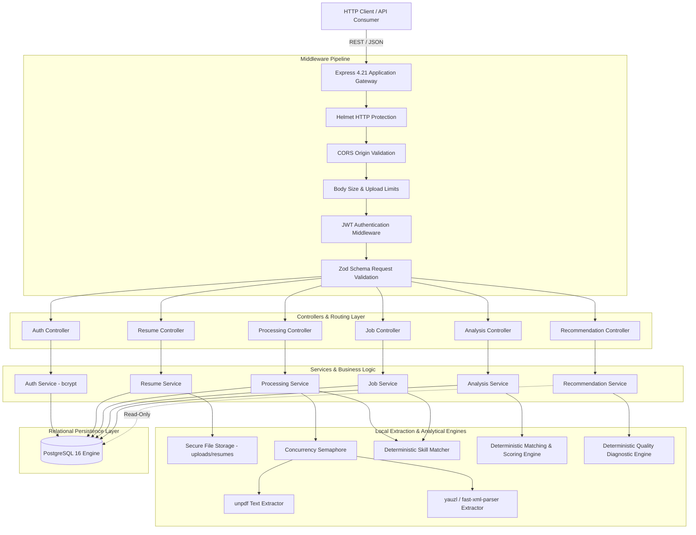
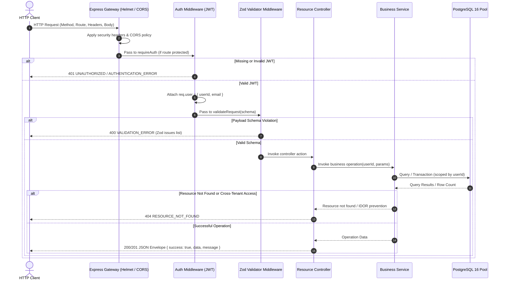
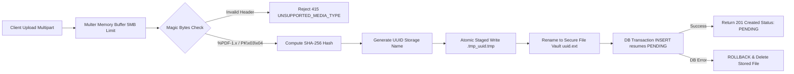
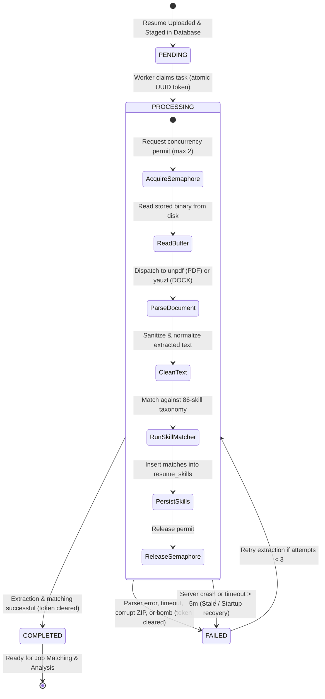
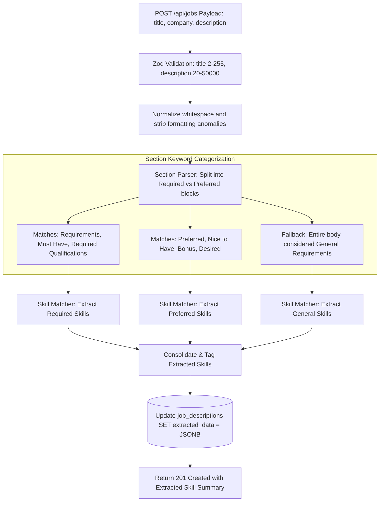
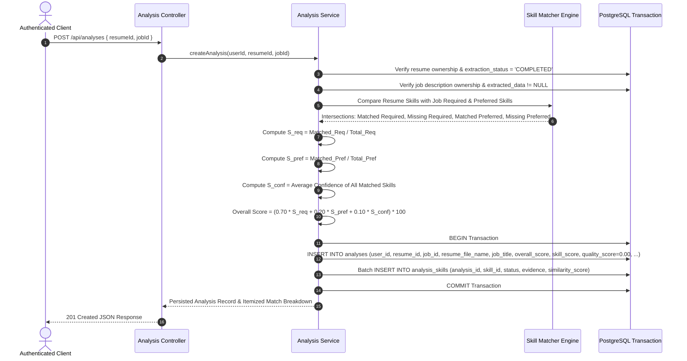
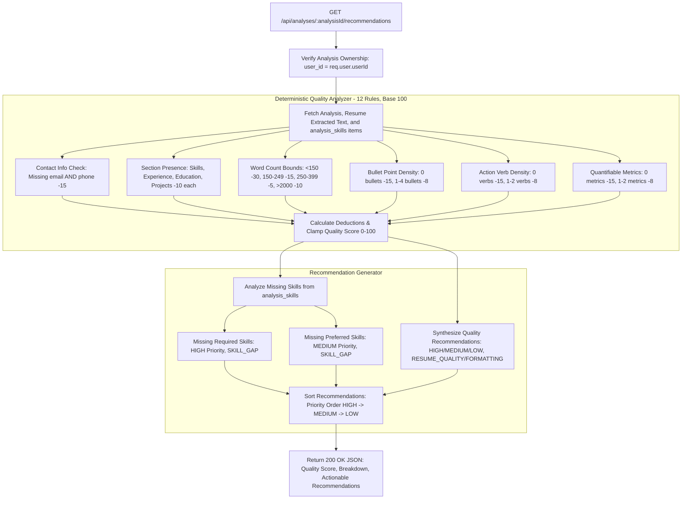
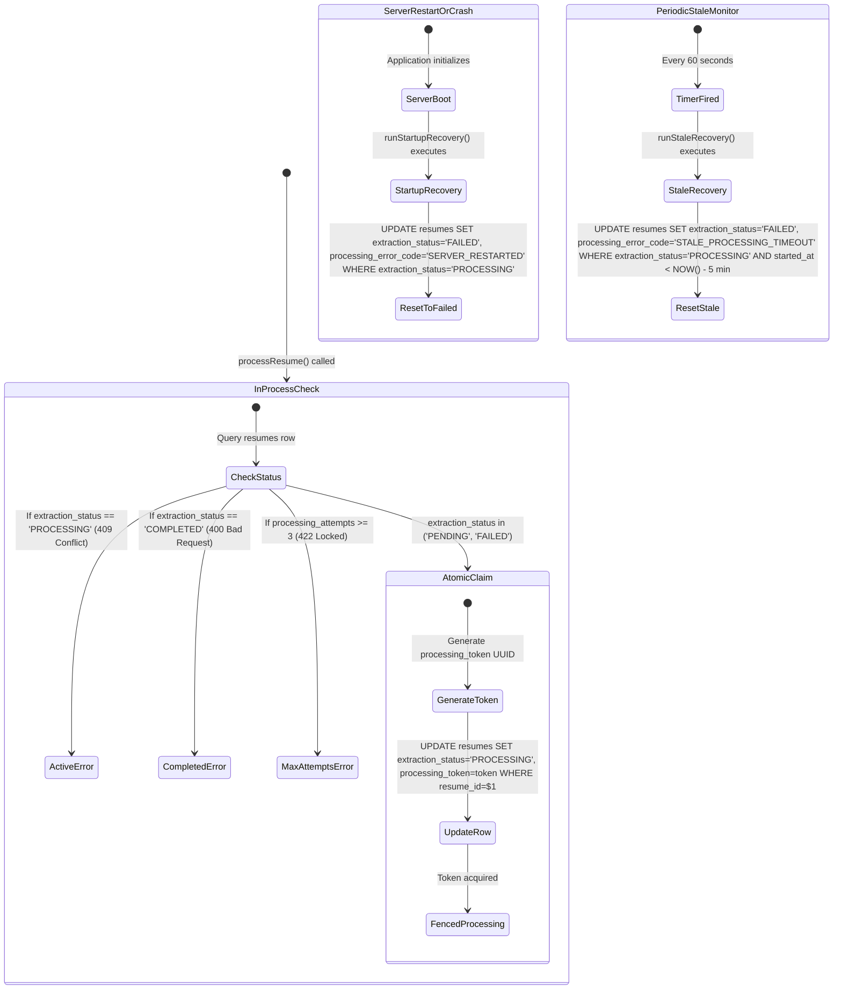

# System Architecture & Flow Diagrams

This document contains architectural, pipeline, and state-flow diagrams illustrating the components and data flows of the **AI-Powered Resume Analyzer and Job Matching Platform**.

All diagrams use GitHub-compatible Mermaid syntax.

---

## 1. High-Level System Architecture

The application is structured as a modular Node.js native ECMAScript Modules (ESM) backend operating over a PostgreSQL relational store, using local deterministic processing engines for document extraction, skill taxonomy matching, scoring, and recommendation generation.



---

## 2. Backend Request Processing Flow

Every incoming HTTP request traverses a defense-in-depth pipeline ensuring protocol hardening, tenant identity resolution, payload contract validation, controller routing, transactional service logic, and consistent JSON envelope responses.



---

## 3. Resume Ingestion & Storage Pipeline

The resume ingestion subsystem validates incoming files through multiple stages to enforce file size boundaries, magic-byte integrity, sanitized naming, quarantined staging, and transactional persistence.



---

## 4. In-Process Text Extraction State Machine

Resumes transition through four discrete lifecycle states stored in `resumes.extraction_status`: `'PENDING'`, `'PROCESSING'`, `'COMPLETED'`, and `'FAILED'`. Processing concurrency is fenced using atomic database claim tokens.



---

## 5. Deterministic Skill Extraction Pipeline

The deterministic skill matcher normalizes text and matches candidate qualifications against the 86-skill catalog using regular expressions with word boundary and short-token lookahead fencing.

```mermaid
flowchart TD
    Start[Raw Text Stream - Resume or Job Description] --> Sanitize[Sanitize Text: normalize whitespace, strip control chars]
    Sanitize --> DetectSections[Detect Context Sections: Skills, Experience, Education, Projects]
    DetectSections --> IterTaxonomy[Iterate Taxonomy Skills - 86 Canonical Catalog]
    
    IterTaxonomy --> TokenClassifier{Token Type Check}
    TokenClassifier -->|Single-Letter / Short Token: C, R, Go| FencedRegex[Strict Lookahead/Lookbehind Fencing: (?<![a-zA-Z0-9])TOKEN(?![a-zA-Z0-9+#])]
    TokenClassifier -->|Multi-Word / Standard Token| WordBoundaryRegex[Standard Word Boundary Regex: \bTOKEN\b]
    
    FencedRegex --> AliasScan[Scan Canonical Name & Known Aliases]
    WordBoundaryRegex --> AliasScan
    
    AliasScan --> MatchCheck{Match Found?}
    MatchCheck -->|No| NextSkill[Next Taxonomy Skill]
    MatchCheck -->|Yes| CalcConfidence[Calculate Match Confidence: exact=1.00, alias=0.85, section weight=1.10]
    CalcConfidence --> Deduplicate[Deduplicate Canonical Skill Names]
    Deduplicate --> Output[Structured Extracted Skills Array]
    NextSkill --> IterTaxonomy
```

---

## 6. Job Description Ingestion & Extraction Flow

Job descriptions are sanitized, parsed into contextual sections (Required vs. Preferred qualifications), extracted using the deterministic skill matcher, and persisted into `job_descriptions.extracted_data`.



---

## 7. Resume ↔ Job Compatibility Matching Engine

Stage 3 executes atomic compatibility matching between a processed resume and an extracted job description, calculating a deterministic composite score and persisting both parent analysis and child itemized skill records.



---

## 8. On-Demand Quality Diagnostics & Recommendation Engine

Stage 4 computes resume quality diagnostics and actionable recommendations dynamically upon retrieval without writing or mutating database records.



---

## 9. Concurrency Control & Crash Recovery Flow

The processing service protects extraction workers against thread pool saturation, worker crash abandonment, and concurrent task duplication.


